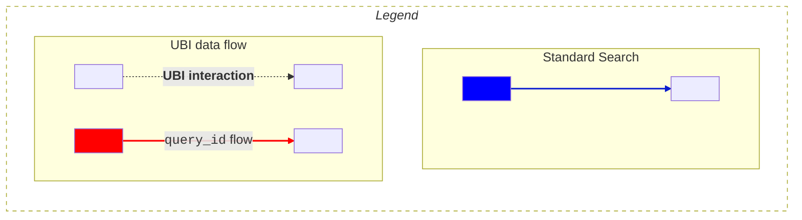
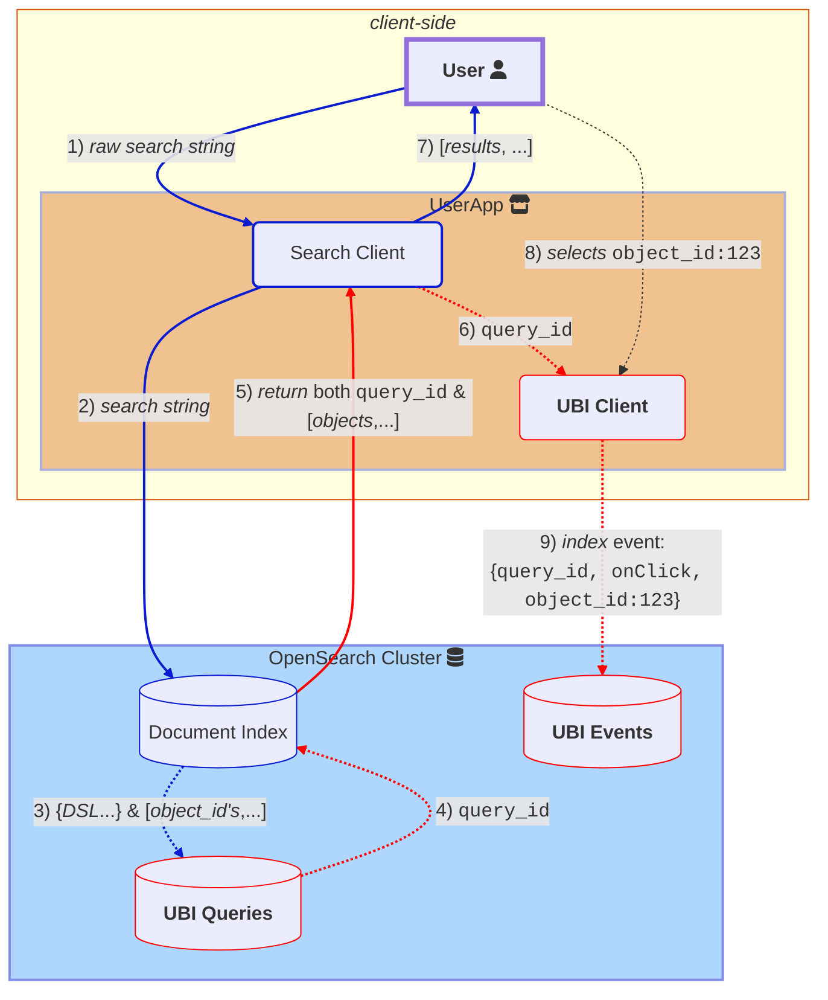

# UBI 索引結構描述

User Behavior Insights (UBI) 資料收集過程包括追蹤與記錄使用者提交的查詢，以及在收到搜尋結果後監控並記錄使用者後續的動作或事件。資料收集過程涉及兩種 UBI 索引結構描述：
* [查詢索引](#ubi-queries-index)，用於儲存搜尋與結果。
* [事件索引](#ubi-events-index)，用於儲存使用者查詢之後的所有後續使用者動作。

## 關鍵識別碼

若要讓 UBI 正常運作，必須在啟用 UBI 的應用程式中持續維護下列欄位之間的關聯：

- [`object_id`](#object_id) 代表使用者因查詢而收到之物件的 ID。例如，如果您搜尋書籍，它可能是某本書的 ISBN，例如 `978-3-16-148410-0`。
- [`query_id`](#query_id) 是所執行原始查詢的唯一 ID，而 `object_id` 對應至使用者查詢所傳回 _hits_ 的主要識別碼。
- [`client_id`](#client_id) 代表唯一的查詢來源。這通常是指唯一使用者所使用的網頁瀏覽器。
- [`object_id_field`](#object_id_field) 指定索引中提供 `object_id` 的欄位名稱。例如，如果您搜尋書籍，其值可能是 `isbn_code`。
- [`action_name`](#action_name) 雖然技術上並非 ID，但指定對具有特定 `object_id` 的物件所採取（或未採取）的確切使用者動作（例如 `click`、`add_to_cart`、`watch`、`view` 或 `purchase`）。

總而言之，`query_id` 表示透過 `client_id` 追蹤之用戶端的唯一搜尋開始。搜尋會傳回各種物件，每個物件都有唯一的 `object_id`。`action_name` 指定使用者正在執行的動作，並與各個物件連結，每個物件都有特定的 `object_id`。您可以透過檢查 `object_id_field` 來區分物件類型。

一般而言，您可以透過擷取使用者 `client_id` 的所有資料並檢視個別的 `query_id` 資料，來推斷使用者的整體搜尋歷史。每個應用程式會透過檢查後端資料來決定什麼構成一個搜尋工作階段

## 重要的 UBI 角色

下圖說明**使用者**與 **Search client** 及 **UBI client** 互動的過程，以及它們接下來與**OpenSearch 叢集**互動的方式，該叢集存放著 **UBI events** 與 **UBI queries** 索引。

藍色箭頭表示標準搜尋，粗虛線表示 UBI 特有的新增項目，紅色箭頭則表示 `query_id` 與 OpenSearch 之間的往來流程。


The mermaid source below is converted into a PNG under 
.../images/ubi/ubi-schema-interactions.png


以下是關於這些角色的一些重點：
- **Search client** 負責搜尋，然後從 OpenSearch 文件索引接收 *物件*（前圖中的 1、2、**5** 與 7）。

步驟 **5** 以粗體顯示，因為它表示對標準 OpenSearch 互動的 UBI 特有新增項目，例如 `query_id`。
 {: .note}
- 如果在搜尋請求的 `ext.ubi` 區段中啟用，**User Behavior Insights** 外掛程式會在背景管理 **UBI queries** 儲存區，為每個查詢編製索引、確保所有傳回的 `object_id` 值都有唯一的 `query_id`，然後將 `query_id` 傳回給 **Search client**，以便將事件連結至查詢（前圖中的 3、4 與 **5**）。
- **物件**代表使用者透過查詢搜尋的項目。啟用 UBI 需要將您的真實世界物件（使用其識別碼，例如 `isbn` 或 `sku`）對應至所搜尋索引中的 `object_id` 欄位。
- **Search client** 若與 **UBI client** 分開，會將已編製索引的 `query_id` 轉送給 **UBI client**。
    雖然在此圖中 *搜尋* 與 *UBI 事件索引* 的角色是分開的，但許多實作可以對這兩個角色使用同一個 OpenSearch 用戶端執行個體（前圖中的 6）。
- **UBI client** 接著會以指定的 `query_id` 為所有使用者事件編製索引，直到執行新的搜尋。此時，**User Behavior Insights** 外掛程式會產生新的 `query_id` 並傳回給 **UBI client**。
- 如果 **UBI client** 與結果**物件**互動，例如在**加入購物車**事件期間，則 `object_id`、`add_to_cart` `action_name` 與 `query_id` 會一起編製索引，表示 *搜尋* 與 *物件* 之間的因果關聯（前圖中的 8 與 9）。

## UBI 儲存區

支援 UBI 資料收集涉及兩個獨立的儲存區：
* UBI queries
* UBI events

### UBI queries 索引

所有底層查詢資訊與結果（`object_ids`）都儲存在 `ubi_queries` 索引中，並且在背景中大多不可見。

`ubi_queries` 索引的[結構描述](https://github.com/OpenSearch-project/user-behavior-insights/tree/main/src/main/resources/queries-mapping.json)包含下列欄位：

- `timestamp`（事件與查詢）：ISO 8601 格式的時間戳記，表示收到查詢的時間。

- `query_id`（事件與查詢）：由用戶端應用程式提供或由搜尋引擎產生的查詢唯一 ID。具有相同文字的不同查詢會產生不同的 `query_id` 值。

- `client_id`（事件與查詢）：由用戶端應用程式提供的用戶端 ID。

- `query_response_objects_ids`（查詢）：物件 ID 的陣列。ID 可以與 `_id` 具有相同的值，但它是指文件、項目或產品的外部有效 ID。

由於 UBI 會管理 `ubi_queries` 索引，您應該永遠不需要直接寫入此索引（匯入資料時除外）。

### UBI 事件索引

用戶端會直接將事件編製索引至 `ubi_events` 索引，並連結事件 [`action_name`](#action_name)、物件 (每個物件都有一個 `object_id`) 以及查詢 (每個查詢都有一個 `query_id`)，以及任何其他重要的事件資訊。
由於此結構描述是動態的，您可以在編製索引時新增任何目前 **UBI events** [結構描述](https://github.com/opensearch-project/user-behavior-insights/tree/main/src/main/resources/events-mapping.json) 中沒有的新欄位或結構 (例如使用者資訊或地理位置資訊)。

開發人員可以在 [`event_attributes`](#event_attributes) 下定義新欄位。
{: .note}

以下是 `ubi_events` 索引中預先定義的最小欄位：

 
 

- `application` (大小 100)：追蹤 UBI 事件的應用程式名稱 (例如 `amazon-shop` 或 `ABC-microservice`)。
 
 
 

- `action_name` (大小 100)：觸發事件的動作名稱。UBI 規格定義了一些常見的動作名稱，但您可以使用任何名稱。

 
 

- `query_id` (大小 100)：查詢的唯一識別碼，通常是 UUID，但可以是任何字串。
 `query_id` 由用戶端提供，或由 UBI 外掛程式在查詢時產生。**UBI queries** 和 **UBI events** 索引中的 `query_id` 值必須一致。

 

- `client_id`：發出查詢的用戶端。這通常是唯一使用者所使用的網頁瀏覽器。
 **UBI queries** 和 **UBI events** 索引中的 `client_id` 必須一致。

- `timestamp`：事件發生的時間，採用 ISO 8601 格式，例如 `2018-11-13T20:20:39+00:00Z`。

- `message_type` (大小 100)：用於將動作分組的邏輯分類 (每個動作都有一個 `action_name`)。例如，`QUERY` 或 `CONVERSION`。 

- `message` (大小 1,024)：記錄項目的選用文字訊息。例如，對於 `message_type` `QUERY`，`message` 可以包含與使用者搜尋相關的文字。

 
 

- `event_attributes`：描述事件重要內容的可擴充結構。此結構由兩個主要結構組成：`position` 和 `object`。此結構可擴充，因此您可以新增事件的自訂資訊，例如事件的時間、使用者或工作階段。
  
 由於 `ubi_events` 索引已設定為執行動態對應，索引可能會因為許多新欄位而變得過於龐大。
  {: .warning} 

 - `event_attributes.position`：包含事件來源位置相關資訊的結構，例如螢幕 x、y 座標，或物件在結果清單中的位置：
 
   - `event_attributes.position.ordinal`：追蹤使用者可選取的清單位置 (例如，選取第三個元素可以描述為 `event{onClick, results[4]}`)。

    - `event_attributes.position.xy.{x,y}`：追蹤由用戶端定義的 x 和 y 值。
    
  - `event_attributes.object`：包含查詢所傳回物件 (例如書籍、產品或貼文) 的識別資訊。
   `object` 結構可以透過內部 ID 或物件 ID 來參照物件。`object_id` 是將先前的查詢連結至此物件的 ID。此欄位包含下列子欄位：
  
    - `event_attributes.object.internal_id`：OpenSearch 用來在內部將物件編製索引的唯一 ID，例如索引中的 `_id` 欄位。

      

    - `event_attributes.object.object_id`：使用者可藉以在**文件集合**中找到物件執行個體的 ID。範例包括 `ssn`、`isbn` 或 `ean`。變體必須納入 `object_id`，因此紅色 T 恤的 `object_id` 應該是其 SKU。
      初始化 UBI 需要將文件索引的主要索引鍵對應至此 `object_id`。
      

      

         
    - `event_attributes.object.object_id_field`：指出物件的類型/類別，以及包含 `object_id` 的搜尋索引欄位名稱，例如 `ssn`、`isbn` 或 `ean`。

    - `event_attributes.object.description`：物件的選用描述。

    - `event_attributes.object.object_detail`：物件的選用其他資訊。
          
    - *可擴充欄位*：請注意，`object` 中任何新編製索引的欄位都會動態擴充此結構描述。
